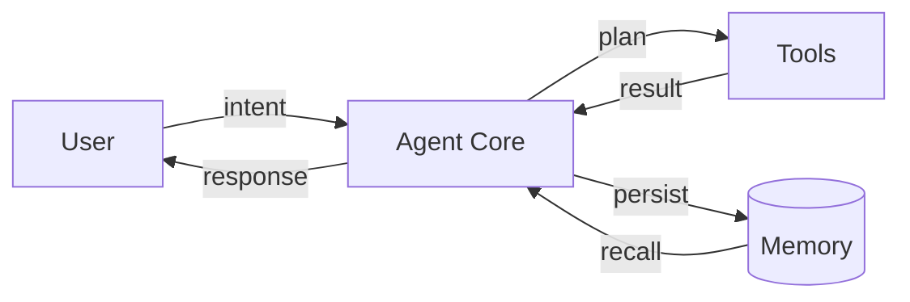

# MDE Agent Flow Demo

This file shows a clean, consumable pattern for architecture notes:

1. Explain the intent in plain language.
2. Render a flow diagram directly in the doc.
3. Keep naming and arrows consistent across all diagrams.
4. Pair the doc with a runnable notebook for proof.

## Why this style is easy to consume

- Short section headers and one idea per section.
- Visual first, details second.
- Stable node semantics:
  - `User` sends intent.
  - `Agent Core` reasons and decides.
  - `Tools` execute side effects.
  - `Memory` stores and retrieves context.
- Arrow labels encode control flow (`plan`, `call`, `observe`, `persist`).

## Generic Agent Architecture




## Write-up template you can reuse

Use this section ordering for every feature note:

```md
## Problem
## Inputs and constraints
## Agent flow diagram
## Minimal runnable path
## Failure modes
## Next iteration
```

## Runnable companion

Open `notebooks/agent_flow_demo.ipynb` for the same flow as a notebook with:

- markdown narrative cells
- a rendered inline SVG diagram
- a tiny runnable execution trace

